```{r SETUP , echo=FALSE, message=FALSE}
knitr::opts_chunk$set(fig.retina = 2,
                      tidy.opts = list(width.cutoff = 120),  # For code
                      options(width = 120) )  # For output

options(scipen = 999, digits = 2)
```

 
```{r LOADPCK, message=FALSE, warning=FALSE, include=FALSE}
if (!require("pacman")) {
	install.packages('pacman' )
}


library(pacman) # for loading packages
p_load(tidyverse,
		 stringr,
		 forcats,
		 scales,
		 patchwork,
		 countrycode,
		 sf,
		 here,
		 kableExtra,
		 summarytools,
		 pander, 
		 DT) 
```


## Exploratory Data Analysis of WSS Operators Sample in Mexico

The observation of survey outcomes will compare across potential relevant features:

+ **Ownership/type** and 
+ **Size of covered area** 
+ **Service mix** (W/S/W+S)
+ (possibly) **Prevalence of urban vs rural coverage vs**
+ (**Age**)
+ (**State**)


Here is a very basic distribution of our sampled Suppliers in Mexico, by state, ownership and size of Coverage reach.

> The vaste majority of operators is public, while there is more variation in size of covered area. 

```{r tblcov, results="asis", warning=FALSE}
load(here::here("output", "tbl_uf_own_cov.Rdata"))
# class(tbl_uf_own_cov)
caption <- "Sampled Suppliers in Mexico, by State, Ownership Type and size of Coverage reach"
covtable <- pandoc.table.return(tbl_uf_own_cov, 
										  keep.line.breaks = F, 
										  style = "multiline", 
 										  justify = "lcrr", 
										  caption = caption
										  )

cat(covtable)
```


##  Legislative Context

1. Overall, the majority of the Suppliers declare they operate in a context where there is legislation for key operational aspects such as:
	+ Coverage Areas
	+ Service 
	+ Quality
	+ Tariffs 
	
	
<center>
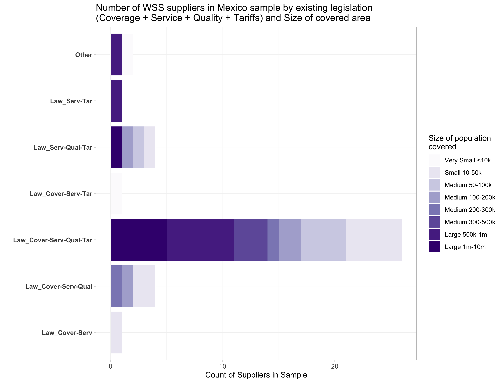
</center>

 

<center>
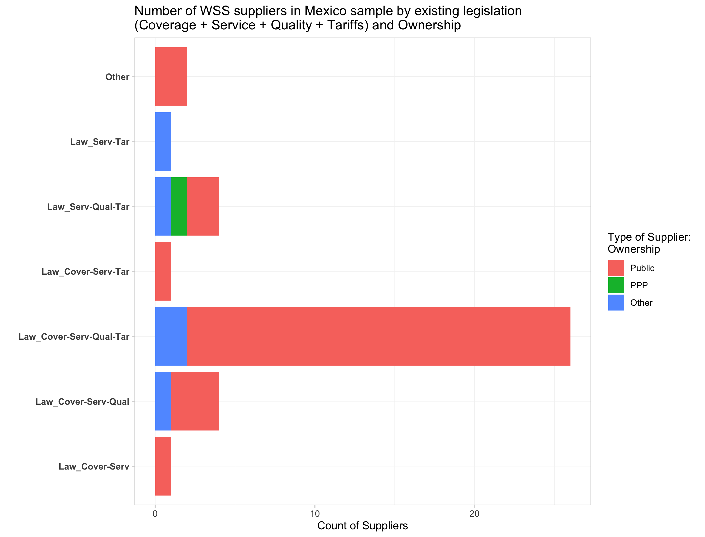
</center>

 

## 1) COVERAGE & SERVICE

### Summary of key coverage numeric variable 


```{r tbldescstatcov, results="asis", warning=FALSE}
load(here::here("output", "tbl_descstat_cov.Rdata"))
# class(tbl_descstat_cov)

caption <- "Summary of Coverage variables"
var.summary <- pandoc.table.return(tbl_descstat_cov , 
											  keep.line.breaks = TRUE,
											  round = 2,
											  big.mark = ",",
											  justify = "llrrrrrr", # OKKIO AL # DI COLONNE
											  caption = caption, style = "multiline",
											  split.table = Inf
											  )

cat(var.summary)

```

+ The WSS suppliers in the sample - as of `r format(Sys.time(), '%B %e, %Y')` - cover an average of **`r tbl_descstat_cov[3,4]` municipios** (almost always in one State), corresponding to a mean **covered population of `r tbl_descstat_cov[4,4]`**. 
+ The suppliers on average serve localities that are **`r tbl_descstat_cov[6,4]` urban**. 


### Area(s) covered vs. service

> Is there any difference between the Product MIX `Q9a_d_Mix_comb` across the URB-RUR type of coverage of the supplier `Q4_UrbRur_Mix`[^1]?

Suppliers serving exclusively rural areas do not provide sanitation. Otherwise, the majority of suppliers provide all 4 services accounted for: 
	+ Water generation
	+ Water Distribution
	+ Sanitation
	+ Wastewater Treatment 
 

<center>
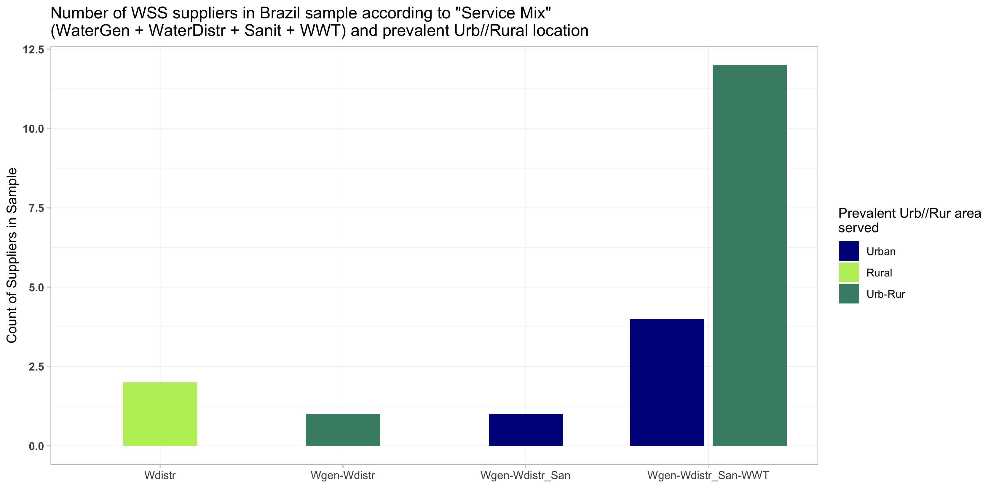
</center>

[^1]: Later on, I would like to explore if  _(?) Is the urbanization process (size, local distribution, rate) causing the lack (access, quality, affordability ) to service in the region (controlling for physical assets / hydrological condition, pop #,  etc) ? ??_

> NEXT:... (?) Is the urbanization process (size, local distribution, rate) causing the lack (access, quality, affordability ) to service in the region (controlling for physical assets / hydrological condition, pop #,  etc) ? ??


### Summary of key service charateristics  

Observations on the WSS suppliers surveyed as of `r format(Sys.time(), '%B %e, %Y')`,  ...

```{r tbldescstatcovserv, results="asis", warning=FALSE}
load(here::here("output", "tbl_descstat_covserv.Rdata"))
# class(tbl_descstat_cov)

caption <- "Summary of Service variables"
var.summary <- pandoc.table.return(tbl_descstat_covserv , 
											  keep.line.breaks = TRUE,
											  round = 2,
											  big.mark = ",",
											  justify = "llrrrrrr", # OKKIO AL # DI COLONNE
											  caption = caption, style = "multiline",
											  split.table = Inf
											  )

cat(var.summary)
```


 

### NRW % levels
> Lit Input: 
Some key determinants of high NRW are: 
1. The cost of implementing counter-measures 
2. A political cost associated with the control of unauthorized consumption in marginalized ares 
3. A cost to those people who benefit from corruption 
4. Technical cost of shortening leakage detection time & improving pressure management (especially when the cost of pumping more raw water is 0 or low) [see @gonzalez-gomez_why_2011, pp. 33-35;  ch. 1].
 


Based on the information collected via the survey, we can estimate NRW as per International Water Association’s (IWA) definition: NRW is defined as water that is placed into a water distribution system that is not billed to customers. 
Our derived indicator is **`NRWm3_pct`** { = (`Q12b_m3_In_Tot` - `Q13_m3_Fatt_Tot`) / `Q12b_m3_In_Tot` *100 }


```{r tblNRWrecap, , message=FALSE, warning=FALSE, warning=FALSE}
load(here::here("output", "MX_NRW.Rdata"))
library(DT)
# class(tbl_descstat_cov)

# SIMPLE TABLE WITH FILTER
MX_NRW %>%
  dplyr::select(-M1_oper_id, -Q12b_m3_In_Tot, -Q13_m3_Fatt_Tot) %>%
	# dplyr::arrange(entidad) %>% 
  DT::datatable(.,
    elementId = NULL,
    # filter = 'top',  # Problem if there are empty cells !!!
    extensions = "Buttons",
    options = list(pageLength = 50, searchHighlight = TRUE, dom = "Bfrtip", buttons = c("csv", "excel", "pdf"))
  ) %>%
  # helper functions
  DT::formatRound("NRWm3_pct", 1) %>%
  DT::formatStyle("NRWm3_pct", backgroundColor = "yellow") %>%
  DT::formatStyle("NRWm3_pct", color = styleInterval(50, c("black", "red")))

```


>>>> must check huge outliers messing up things 

Initial exploration shows that: 

1. On average, the % NWR varies quite dramatically across different ownership types (PUBLIC-owned ??%  <  Other ??% < Private ??% (more dispersed))
2. Mean % NWR is lower for suppliers exclusively serving urban areas (??%) than for suppliers servin mixed-urb-rur (??%) ... but sems quite disperserd.
3. On average, the size of served population, is also a great source of variation in the %NRW - highest found in 500-900k size (58%) and smallest in 10-50k size (7%) 
 

<center>
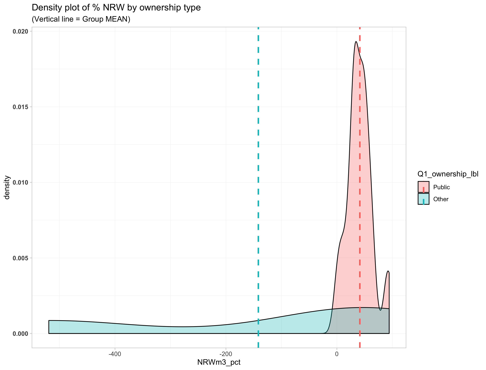
</center>


<center>
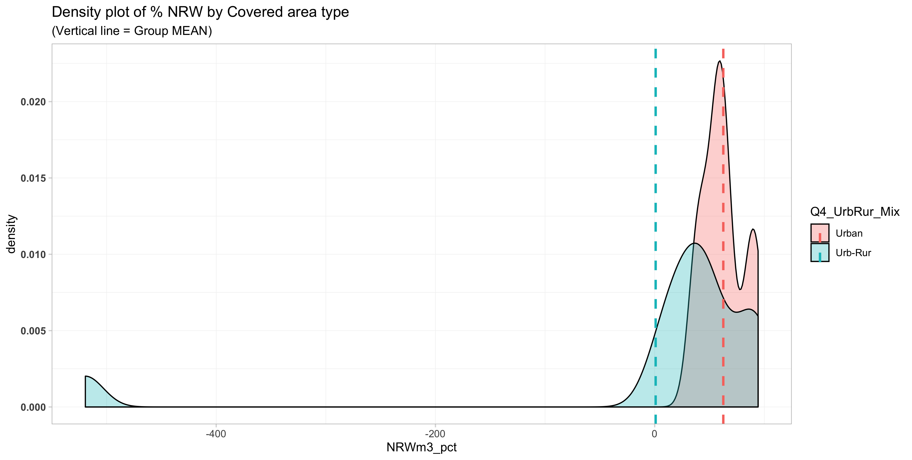
</center>


<center>
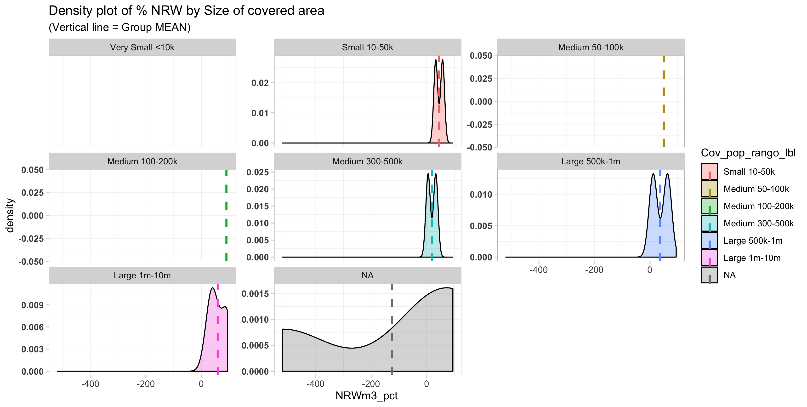
</center>


### NRW correlation with "suspected" determinant factors 
Visually explore whether the **% of NRW** shows any type of correlation with some variables that could be relevant: 


1. **`Q27_IndivMeter_Perc`**  --> no stryking connection 

<center>
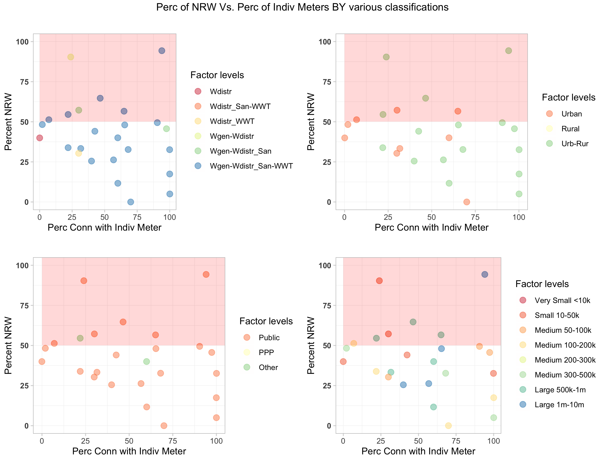
</center>

2.  **`Q40_NetworkYrlyInspected_Perc`**  --> no stryking connection 

<center>
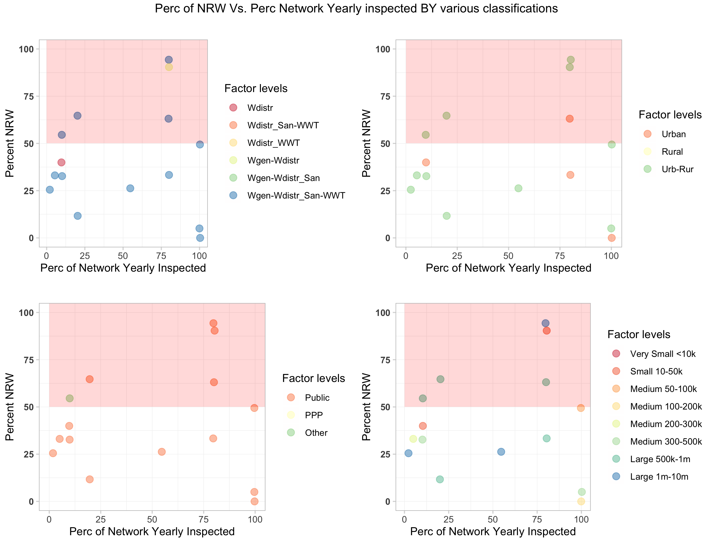
</center>
 

 ---


3. **`Q24_VolLossMech_Has`**  --> most suppliers say "Yes" (have a system to record VOLUME LOSSES)  

<center>
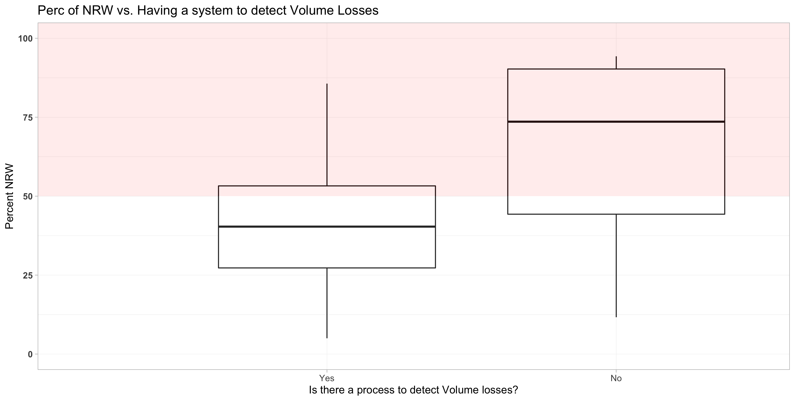
</center>


4. **`Q39_LeaksDetection_Analyzed`**  --> most suppliers say "Yes" (have a systematic campaign to detect ruptures and LEAKS) and those cases show a somewhat lower NRW   

<center>
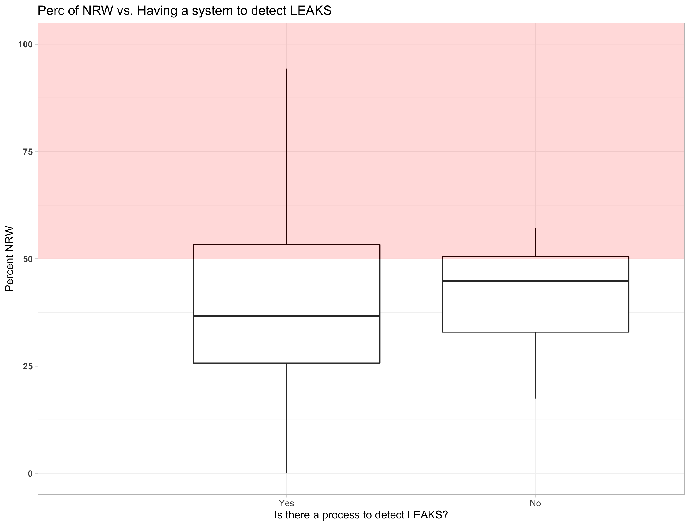
</center>

5. **`Q41_ClandConn_Analyzed`**  --> the vast majority suppliers say "Yes" (have a system) and those cases show a significantly lower NRW (for now the NO sub-sample is too small to further analyze)

<center>
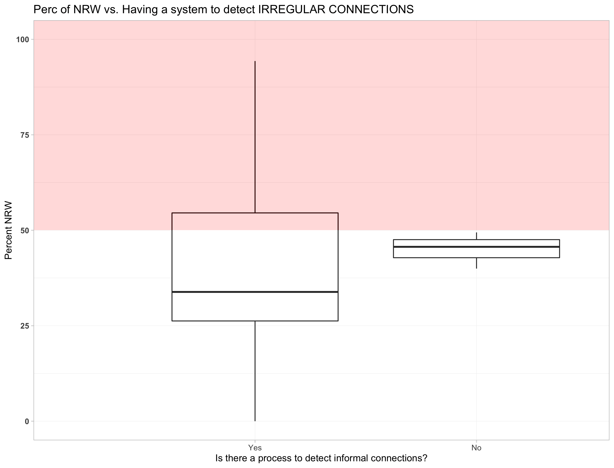
</center>


>  > NEXT ... Further exploration ..... 
	+ Exist procedim for estimation of vol loss/ (Q24)	  
	*  (?) Is the year of operation anywhere connected with efficiency?  
	*  (?) Is thestack of laws connected with efficiency (Expected inverse relation)?? `Q8a_c_Leg_comb`  `Q8a_LegInst_Cover` `Q8b_LegInst_DirServ` "`Q8c_LegInst_DirQual` `Q8d_LegInst_Tarif`", 
 

 

### Reliability of the service (Interruptions)
> Lit Input: Performance can improve with: 
1) carefully designed private sector participation in service provision 
2) regulatory agencies that are transparent, accountable, and free of political interference, 
3) strong accountability mechanisms for SOE. [see @andres_uncovering_2013 ].


Y + Reliability = Q4... Q45 interruptions 
X + location 
	+ size 
	+ age? Q6
	+ Quality regulation (q8c)
	+ SWIT penetration ? 
	+ % eng in staff
	+ % IT in staff? 

The table below shows responses related to the incidence of service interruptions in the past 12 months.  

```{r tblRELrecap, message=FALSE, warning=FALSE, results="asis"}
load(here::here("output", "MX_REL.Rdata"))
library(DT)
# class(tbl_descstat_cov)

# SIMPLE TABLE WITH FILTER 
#datatable(data= MX_REL  , filter = 'top')
DT::datatable(MX_REL, 
				  elementId = NULL, 
				  #filter = 'top',  
				  extensions = 'Buttons', 
				  options = list( pageLength = 50,	dom = 'Bfrtip', buttons = c( 'csv', 'excel')),
				  caption = 'Individual Supplier\'s Responses about Service Interruptions') %>%
	formatRound("Perc of network affected", 1) %>%
	formatRound("Avg # days of interruption", 1) %>% 
		DT::formatStyle("Perc of network affected", color = styleInterval( 50, c('black', 'red')) )

```


The chart below shows the most frequent causes for service interruption p 

<center>
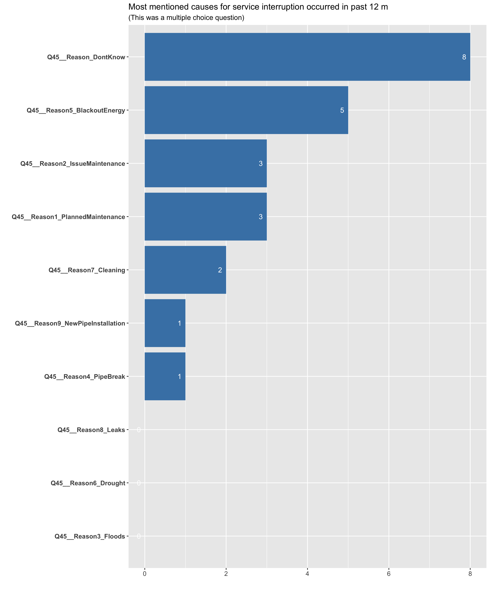
</center>


## 2) SWIT
Use of SWIT still not widespread for various barriers:
+ high capital investments
+ slow cost recovery 
+ limited technical capacity, particularly for small utilities, 
+ lack of integration between different technologies

### Summary of SWIT adoption in the Mexico sample  
The table belows shows to what degree the WSS suppliers in the sample  `nrow(MX_REL)` already adopt various types of Smart Water Management: dedicated R&D and IT departments, Network Management systems, GIS, Hidraulic Models, DMA & pressure management, and Smart meters. 

The % of adoption (albeit Count includes when tools are still "in construction") appear quite high. 

> NOTES 
+ Some of the respondents are actually large companies comglomerate, so will have to understand better their distribution by size and ownership.... 
+ Even when companies say "yes" to the adoption (e.g. smart meter) it may be just a pilot...  
 
<center>
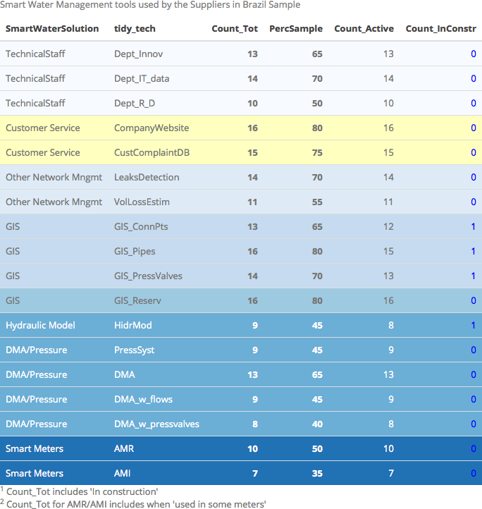
</center>

Below is a different graph to show the degree of adoption of various types of technologies.

<center>
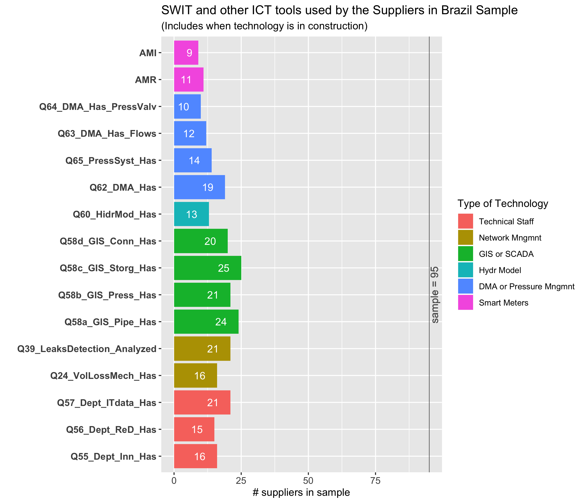
</center>

 

## 3) CORPORATE GOVERNANCE 

<!-- Y + Index of regulation (Q8a....Q8d) cumulative -->
<!-- 	+  -->


We learned from the survey who is entitled to hire & fire the CEO / President of the agency, his/her remuneration the Sr. Directors. 

### Appointment of CEO/President/Sr Directors in the Mexico sample  

The plots below compare the above across types of ownership and size of the covered area. 

+ It would appear that the "Prefeito/Gobernador" is in charge in most of the public agencies 
+ In privately owned suppliers, the Board seems the have the responsability monst cases  


<center>
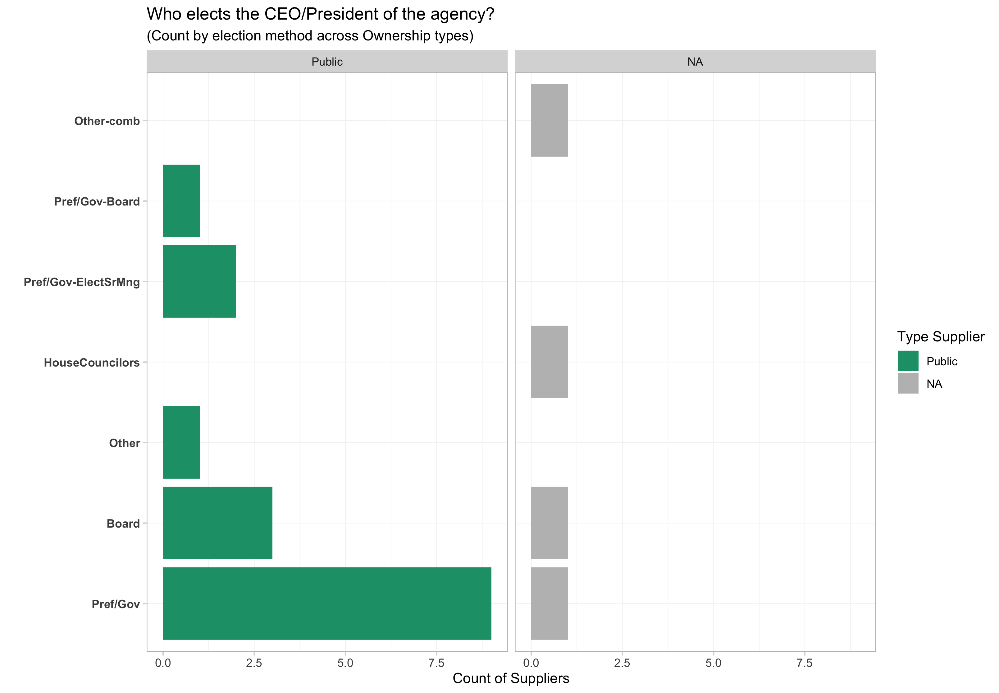
</center>

<center>
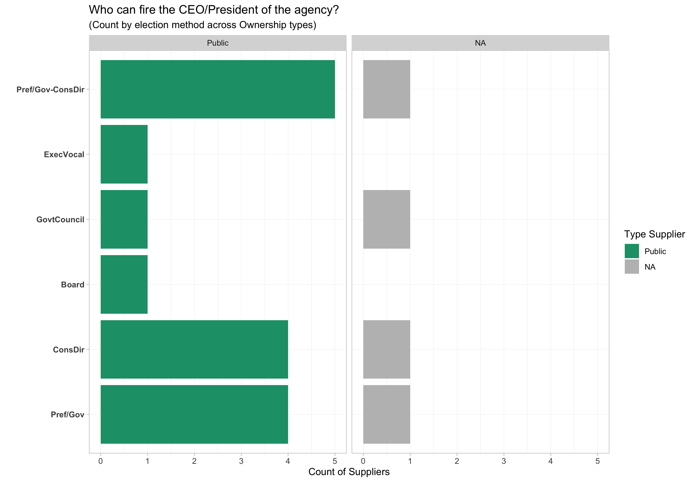
</center>


<center>
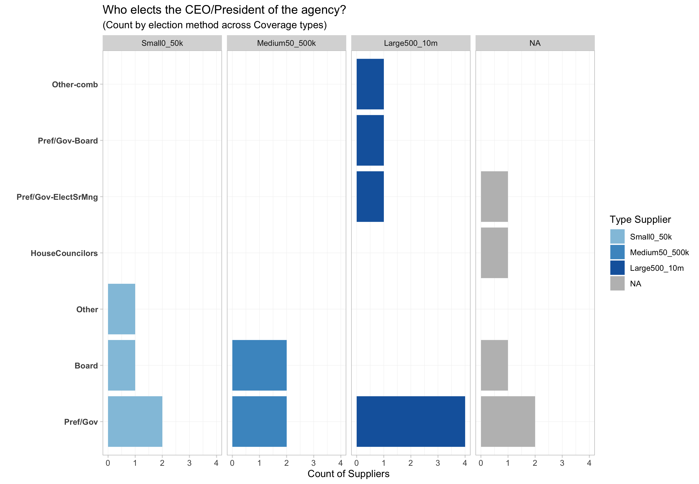
</center>

<center>
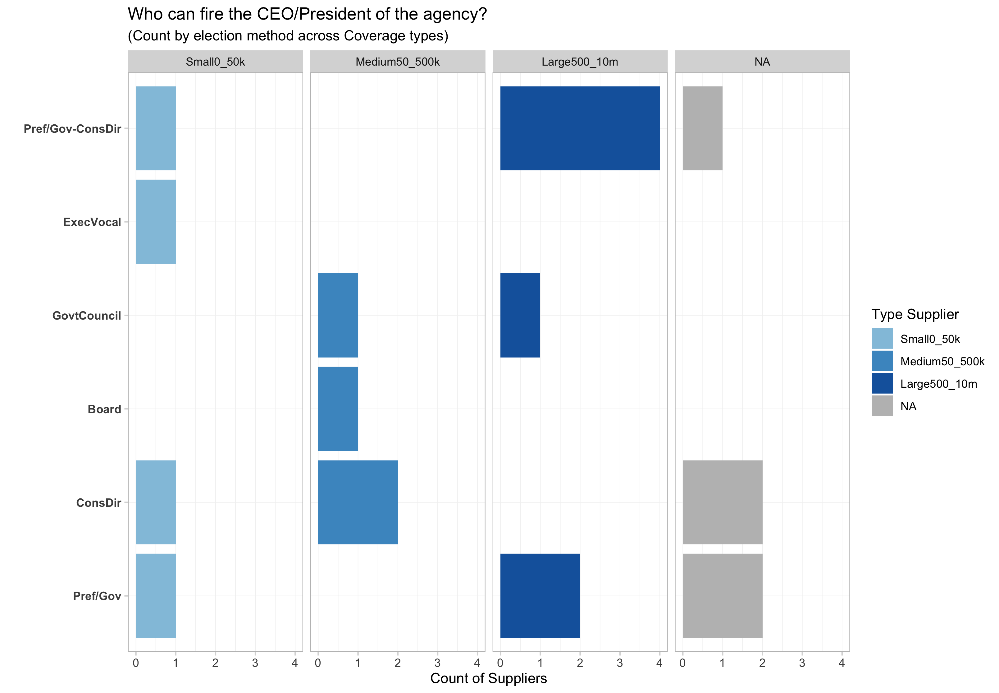
</center>


---

<center>
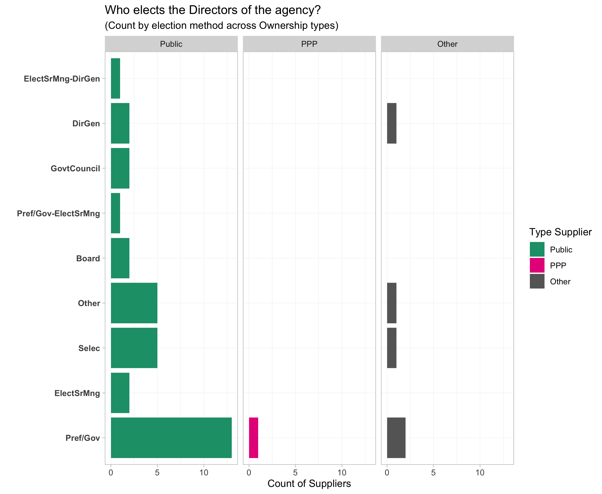
</center>

<center>
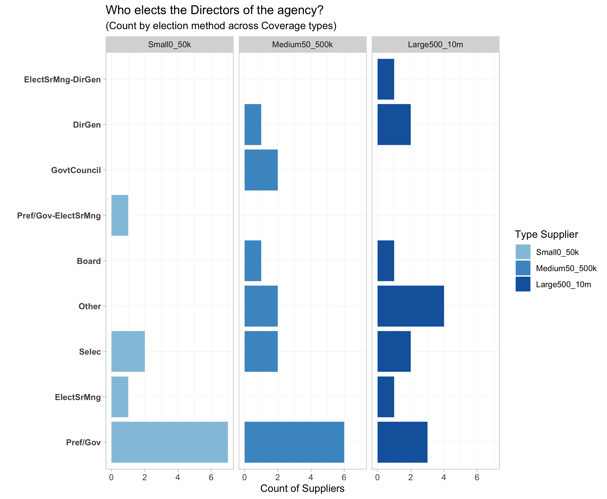
</center>


## 4) FINANCE 
> Lit Input: 
1) under-investment + dilapidated infrastructure --> INEFFICIENCIES [see @arniella_can_2018 ]
2) Energy consumption much of O&M costs [see @lackey_energy_2017] 


## 5) TARIFFS
> IADB (?): we have no idea if tariffs are low or high in LAC (people say are too low, but in fact they are not showing in the Database) 


## REFERENCE


